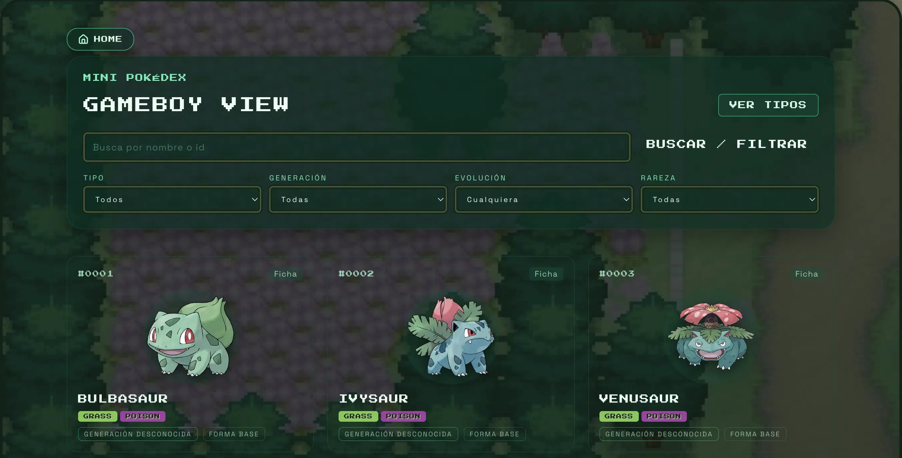

<div align="center">
  
  <h1 style="margin-bottom:0">🧭 Mini Pokédex</h1>
  <p style="margin-top:4px">Toque Game Boy, filtros veloces y fondos que no pierden detalle.</p>
</div>

<p align="center">
  
</p>

---

## ✨ Highlights
- Paginación con filtros combinables (tipo, generación, etapa, legendarios).
- Fichas con arte oficial, stats clave y salto rápido a la vista detallada.
- Fondos fijos en cover/center para mantener nitidez sin “zoom hops”.
- Loader full-screen con Pokéball solo mientras llegan los primeros datos.
- Índice en memoria + calentado en segundo plano para reducir el tiempo de espera inicial.

## 🎮 Cómo se usa
1) Abre la home, juega con los filtros o busca por nombre/ID.
2) Navega páginas con el control inferior; los filtros mantienen la paginación.
3) Entra a `/pokemon/[name]` para ver sprites, flavor text y encuentros.
4) Consulta `/types` para daño/resistencias por tipo.

## 🛠️ Stack
- Next.js 16 (App Router) · React 19 · TypeScript
- Tailwind utilities + UI propia
- Prisma como cliente opcional de caché (Supabase/Postgres)
- PokeAPI como fuente de datos

## 🚀 Scripts rápidos
```bash
npm install          # deps
npm run dev          # entorno local
npm run lint -- --max-warnings=0
npm run build        # producción
```
Por defecto sirve en `http://localhost:3000`.

## 🔧 Variables de entorno
Guárdalas en `.env.local` si activas caché en BD:
```
DATABASE_URL="postgres://<user>:<password>@<host>:5432/<db>"
CACHE_TTL_HOURS=24
POKEAPI_BASE_URL="https://pokeapi.co/api/v2"
```
Sin base de datos, el índice cae a modo memoria sin bloquear el arranque.

## 🧩 Arquitectura en breve
- `src/app`: rutas, layout y páginas (`/types`, `/pokemon/[name]`).
- `src/components`: UI (píldoras de tipo, cards, loaders, paginación, fondos).
- `src/server`: servicios de listado, filtros, perfiles y caché.
- `src/lib`: utilidades (formato, colores de tipo, cliente PokeAPI).

## ⚡ Rendimiento y UX
- Índice: se sirve cache caliente si existe; si no, se construye en background mientras ves resultados mínimos.
- PokeAPI: listados paginados en lotes grandes (250) para bootstrap más rápido.
- Loader: ocupa todo el viewport, pero se retira en cuanto llega la primera tanda.

## ✅ Checklist exprés
- `npm run lint -- --max-warnings=0`
- `npm run build`
- (Opcional) Configura Supabase/Postgres para cachear el índice completo.

## ℹ️ Notas
- Si el primer arranque parece lento sin caché, deja que el índice se caliente; la app ya devuelve los primeros resultados.
- Las búsquedas directas por nombre/ID responden inmediato sin recorrer el índice completo.
